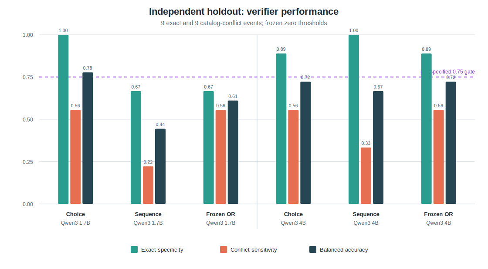
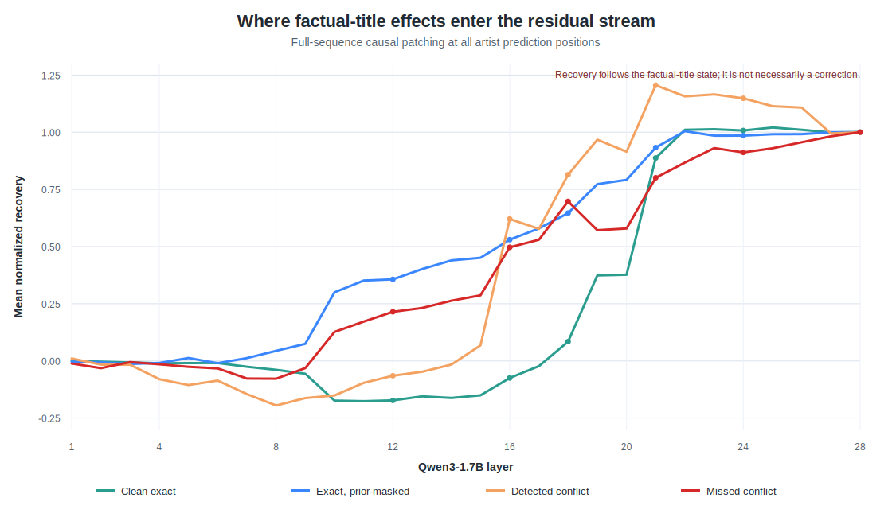

# Music Preference Lens：大模型音乐推荐中的关系幻觉与可信性

[English](README.md) | 简体中文

[](https://github.com/pikaqiu2333/music-preference-lens/actions/workflows/validate.yml)
[](LICENSE)
[](LICENSING.md)

Music Preference Lens 是一项公开、匿名且可复核的独立研究，关注大模型在开放式音乐推荐中生成的 `歌名 + 歌手 + 推荐理由` 是否可信。

研究聚焦一个刻意收窄的问题：

> 当基础大模型自由生成了一组歌名和歌手后，它能否只依靠自己的行为或内部状态，稳定发现这组关系并不受音乐目录支持？

## 一句话结论

**不能稳定做到。**

Qwen3-1.7B 的预设自检规则在 9 条真实关系与 9 条高置信目录冲突组成的独立 holdout 上，Balanced Accuracy 只有 `0.611`，低于冻结的 `0.75` 门槛。换成 Qwen3-4B 复核，仍然漏掉相同的三个唯一冲突关系。

但“模型写错”并不总是同一种机制：

1. 有时正确的歌名-歌手关系信号仍然存在，只是被歌手名先验或最终读出过程压住。
2. 有时模型从中后层开始就形成了错误关系绑定，后续计算只是继续保留或放大它。

因此，内部信号可以用于判断“是否需要复核”，却不能代替外部曲库成为事实真值。产品上更可靠的方案仍然是：**先检索或解析合法 Song ID，再基于已确认的目录元数据生成推荐理由。**

## 为什么研究这个问题

音乐推荐同时包含主观判断和客观约束：

- “这首歌适不适合雨夜开车”是主观问题。
- “这首歌是否由这位歌手演唱”是可核验的实体关系问题。

大模型很擅长生成听起来合理的歌名、歌手和推荐语。即使歌名与歌手并不匹配，理由仍可能流畅地解释节奏、情绪和使用场景。提示词可以减少这类问题，却难以彻底消除；生成后的“请再检查一次”也可能只是在维护前文的一致性，而不是真正核验事实。

本项目因此把推荐质量拆成四个问题：

1. 生成的歌曲实体是否得到目录支持？
2. 歌曲是否符合用户偏好与当前场景？
3. 推荐是否满足语言、版本、无人声等硬约束？
4. 推荐理由是否忠实反映了模型的实际选择过程？

本阶段只对第一个问题进行正式验证，并把推荐理由忠实性保留为独立研究维度。

## 我们做了什么

### 1. 让模型自由生成，而不是从候选列表中选择

生成器与同模型验证器均使用 `Qwen/Qwen3-1.7B-Base`。模型在四类音乐场景下自由生成歌单：

- 雨夜开车；
- 凌晨高能舞池；
- 深夜情绪人声；
- 严格无人声写作。

使用 5 个未参与早期探索的随机种子生成 20 份歌单。所有原始 completion 在解析前保存，冻结解析规则后得到：

| 项目 | 数量 |
| --- | ---: |
| 原始歌单生成 | 20 |
| 成功解析的歌单 | 19 |
| `歌名 + 歌手 + 理由` 事件 | 93 |

未成功解析的一份输出被保留，没有为了提高样本量而人工修复。

### 2. 使用两个外部音乐目录独立核验

93 条结果分别查询 MusicBrainz 与 Apple。为降低目录漏收、同名歌曲和版本歧义带来的误判，正式 holdout 只使用严格样本：

- 两个目录都确认模型输出关系的 exact 事件：9 条；
- 两个目录都支持同一个其他歌手、且均未确认模型输出歌手的 conflict 事件：21 条。

每组按照预先固定的 SHA-256 哈希顺序选择 9 条，形成 `9 exact + 9 conflict` 的独立 holdout。选择过程不查看模型分数，也不根据案例是否“有趣”进行人工挑选。

这里的 **catalog conflict** 是操作性标签，不代表现实世界中绝不存在某个同名或长尾发行版本。

### 3. 在看 holdout 结果前冻结自检规则

正式测试包含两条验证路径：

1. **独立二选一**：固定歌名，让模型在输出歌手与目录参考歌手之间选择；交换两次候选顺序后取平均。
2. **完整歌手名概率**：使用事实型前缀，让模型续写完整歌手名，比较两位歌手全部 token 的平均对数概率。

预设 OR 规则在任一路径更支持目录参考歌手时报警。通过要求同时满足：

- Balanced Accuracy 不低于 `0.75`；
- 真实关系保留率不低于 `0.75`；
- 冲突关系召回率不低于 `0.75`；
- 每组至少 8 条样本。

## 正式结果

### Qwen3-1.7B 检查自己的输出

| 验证路径 | exact 判对 | conflict 判对 | Specificity | Sensitivity | Balanced Accuracy |
| --- | ---: | ---: | ---: | ---: | ---: |
| 独立二选一 | **9/9** | **5/9** | **1.000** | **0.556** | **0.778** |
| 完整歌手名概率 | 6/9 | 2/9 | 0.667 | 0.222 | 0.444 |
| 预设 OR 规则 | 6/9 | 5/9 | 0.667 | 0.556 | 0.611 |

预设规则没有通过验证。完整歌手名概率没有补抓到新的冲突，反而把 3 条真实关系误报为错误，使组合规则比单独二选一更差。

独立二选一在这 9 条 exact 上没有误报，具有一定的风险路由价值；但它只识别了 5/9 conflict，不能作为可靠的事实检测器。

原始推荐上下文中的概率更加不可靠。模型已经写出歌名、歌手和推荐理由后，后续 likelihood 几乎总是支持自己刚刚生成的歌手，测到的更像叙述自洽，而不是事实正确。

### Qwen3-4B 跨模型复核

| 验证路径 | exact 判对 | conflict 判对 | Balanced Accuracy |
| --- | ---: | ---: | ---: |
| 独立二选一 | 8/9 | 5/9 | 0.722 |
| 完整歌手名概率 | **9/9** | 3/9 | 0.667 |
| 预设 OR 规则 | 8/9 | 5/9 | 0.722 |

4B 仍只识别 5/9 conflict，并漏掉与 1.7B 相同的三个唯一关系。这说明至少在当前 Qwen3 同系列和相同验证设置下，简单扩大 critic 规模没有消除知识边界。

需要注意：这里是 4B 检查 1.7B 生成的结果，并不是 4B 对自己生成的歌单进行自检。



## 反事实分析发现了什么

绝对概率选错，并不一定表示模型完全没有正确知识。

我们固定同一对候选歌手，只把真实歌名替换为两个与候选歌手都无目录关系的真实歌名。如果真实歌名相对控制歌名能把分数推向正确歌手，就说明存在可测量的标题条件关系信号。

三个被完整歌手名概率误报的真实关系都出现了正确方向的相对位移：

| 真实关系 | 绝对选择 | 真实歌名产生的相对位移 | 解释 |
| --- | --- | --- | --- |
| `All of Me - John Legend` | 选错 | 向正确方向，较弱 | 正确关系被先验盖住 |
| `Hallelujah - Jeff Buckley` | 选错 | 明显向正确方向 | 正确关系被先验盖住 |
| `Watermelon Sugar - Harry Styles` | 选错 | 明显向正确方向 | 正确关系被先验盖住 |

这说明：**低概率不等于模型不知道，高概率也不等于关系正确。**

三个漏检冲突又分成不同情况：

- `The Knife` 与 `Don't Stop the Music` 没有显示出正确的标题条件位移，真实歌名反而支持错误歌手。
- `Halo` 保留了指向目录参考歌手的序列级相对效应，但最终仍选择错误歌手。

同样的表面错误，可能来自“知识没有被当前探针恢复”，也可能来自“正确信号存在但没有赢得输出”。

## 逐层因果追踪发现了什么

我们把真实歌名条件下、用于预测完整歌手名的内部状态，逐层 patch 到无关歌名条件中，观察歌手候选分数如何变化。

总体结果是：

- 前 12 层几乎没有稳定、可迁移的关系效应；
- 关系效应约在第 16-18 层开始形成；
- 第 18-21 层快速进入 residual stream；
- 第 21 层之后基本稳定保留；
- attention 与 MLP 都参与传递，但不同案例的方向并不相同。



Activation patching 证明某个状态足以复现事实标题带来的效应，但不等于它能纠正答案。如果真实标题在模型内部已经形成错误关系，成功 patch 只会更完整地复现错误。

当前证据支持至少两类失效机制：

1. **正确关系存在，但被实体先验或读出过程压住。**
2. **模型在中后层形成了错误关系绑定。**

这些机制诊断是 holdout 结果冻结后的后验分析，不是一个重新验证过的幻觉检测器。

## 两次停止实验同样重要

项目还按照预先设定的继续门槛停止了两条扩展路线：

- Granite Phase 2 从 385 条解析关系中只得到 7 个唯一严格冲突，低于进入机制实验所需的 30 个。
- Qwen Phase 3 在 360 条自然生成结果中找到 11 个唯一严格冲突歌名，但其中 `0/11` 能在不提供候选答案时稳定恢复目录参考歌手，低于继续研究所需的 8 个。

这两个结果说明，自然生成中的很多长尾目录冲突可能主要来自关系知识缺失。若模型本来就不能主动恢复正确关系，继续训练 probe 或绘制漂亮的层间图，很容易把候选偏好、名称长度或提示模板误当成“模型知道答案”。

因此，未通过继续门槛后停止，并不是实验失败，而是避免在不满足前提的数据上得出无法解释的因果结论。

## 产品启示

一个更可信的音乐推荐系统可以采用以下流程：

```text
用户意图与偏好
      ↓
候选召回 / Song ID 解析
      ↓
目录关系与硬约束校验
      ↓
内部冲突信号决定：通过 / 复核 / 替换 / 拒答
      ↓
基于已确认元数据生成推荐理由
```

具体原则是：

1. 在展示推荐前，先检索或解析合法 Song ID。
2. 把模型内部的分歧当作风险信号，而不是真伪标签。
3. 自检与原输出冲突时，触发曲库查询、换歌或拒答。
4. 推荐理由应从已经 grounding 的歌曲元数据生成。
5. 分开评估实体真实性、偏好匹配、硬约束满足和理由忠实性。

Song ID 可以解决开放词表中的实体合法性问题，但不会自动解决推荐是否适合用户，也不会保证理由真实反映选择过程。

## 这项研究证明了什么，又没有证明什么

### 当前证据支持

- 同一个 Qwen3-1.7B 不能稳定发现自己自由生成的 title-artist conflict。
- 更大的 Qwen3-4B critic 仍漏掉相同关系，简单扩大同系列模型不够。
- 同一种表面幻觉背后可能存在不同的内部失效机制。
- 内部诊断适合用来触发外部复核，不适合单独承担事实 grounding。

### 当前证据不支持

- 不能把预设规则包装成通用音乐幻觉 detector。
- 18 条 holdout 不能用于估计行业幻觉率。
- Catalog conflict 不证明现实中绝不存在任何合法同名发行。
- 行为分数和激活干预不证明模型具有主观意识、自知或欺骗意图。
- 研究使用的是 base model，不能直接外推到带检索、指令微调或生产推荐栈的系统。

## 快速验证

公开完整性验证不需要 GPU，也不需要第三方 Python 包：

```powershell
git clone https://github.com/pikaqiu2333/music-preference-lens.git
cd music-preference-lens
python scripts/validate_publication.py
python -m unittest discover -s tests
```

预期结果：

- publication validator 返回 `ready`；
- 229 项测试中 228 项通过；
- 未安装 NumPy 时，1 项 NumPy 专用测试按设计跳过。

完整 GPU 与 Hugging Face Jobs 复现步骤见 [`docs/reproduce_publication.md`](docs/reproduce_publication.md)。

## 进一步阅读

- [中文阶段研究摘要](reports/music_relation_hallucination_summary.zh.md)
- [英文技术报告](reports/music_relation_hallucination_technical_report.md)
- [独立 holdout 协议](docs/independent_holdout_protocol.md)
- [Granite Phase 2 停止边界](reports/phase2_granite_confirmatory_catalog_yield.zh.md)
- [Qwen Phase 3 可恢复性试验](reports/phase3_qwen_relation_recoverability_pilot.zh.md)
- [相关工作定位](reports/related_work_positioning_2026_07.zh.md)
- [公开数据政策](docs/public_data_policy.md)
- [私有证据哈希回执](runs/private_evidence_receipt.json)

## 公开数据边界

公开仓库包含模型输出、派生目录核验行、冻结选择、分析脚本、结果摘要和完整性回执，但不重新分发 Apple 或 MusicBrainz 的完整原始响应体，也不包含 Apple artwork 或音频预览。

公开数据足以复现已发布的分析和停止决策；重新查询实时目录只能视为当代复现，因为目录服务可能变化。详细边界见 [`docs/public_data_policy.md`](docs/public_data_policy.md)。

## 引用、贡献与许可

- 引用方式见 [`CITATION.cff`](CITATION.cff)。
- 贡献前请阅读 [`CONTRIBUTING.md`](CONTRIBUTING.md)，不要提交第三方原始 API 响应、个人数据或凭据。
- 代码采用 [Apache-2.0](LICENSE)。
- 原创报告与图表采用 [CC BY 4.0](LICENSING.md)。
- 第三方材料不包含在上述授权中，详情见 [`THIRD_PARTY_NOTICES.md`](THIRD_PARTY_NOTICES.md)。
